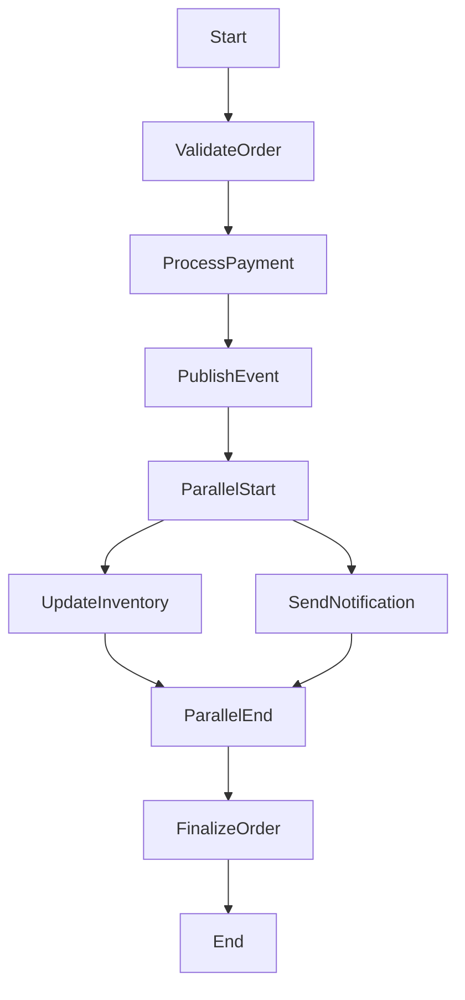

# Orchestra - 响应式业务流程编排框架 (v2.0)

Orchestra 是一个专为领域驱动设计（DDD）应用打造的、基于 RXJava 的响应式业务流程编排框架。它通过类型安全、流畅的 DSL，让你能够以声明式的方式清晰地定义、执行和可视化业务流程。

## 核心特性

- **声明式 DSL**：使用流畅的 API 将复杂的业务逻辑编写成易于阅读和维护的声明式代码
- **响应式核心**：内置基于 RXJava 的响应式支持，天然处理异步、并发和背压，提升系统资源利用率和弹性
- **DDD 友好**：深度契合 DDD 模式，帮助你将分散的领域服务协调为统一的业务用例，明确表达领域故事
- **流程即代码**：将业务流程作为一等公民，使其编译时安全、易于测试和重构
- **状态机引擎** [v2.0]：内置轻量级状态机，轻松管理复杂对象的状态流转
- **事件驱动** [v2.0]：集成分布式事件总线，支持发布/订阅模式和基于事件的流程触发
- **流程可视化** [v2.0]：支持将业务流程代码直接导出为可视化图表（Mermaid/Graphviz），实现"代码即文档"
- **A/B 测试支持** [v2.0]：内置流量分割功能，方便进行新功能的灰度发布或 A/B 测试
- **企业级特性**：内置错误处理、监控、事务管理等生产就绪功能

## 快速开始

### 添加依赖

```xml
<dependency>
    <groupId>io.orchestra</groupId>
    <artifactId>orchestra-core</artifactId>
    <version>2.0.0</version>
</dependency>
```

### 基本用法示例

```java
// 定义业务流程
public class OrderCreationProcedure implements Procedure<OrderRequest, OrderResponse, OrderContext> {
    
    @Override
    public Procedurable<OrderContext> execute(OrderContext context, Composer composer) {
        return composer.just(context)
            .sync(this::validateOrder)
            .async(this::processPayment)
            // v2.0 新特性：事件发布
            .publish(ctx -> new OrderCreatedEvent(ctx.getOrderId()))
            .parallel(
                stream -> stream.async(this::updateInventory),
                stream -> stream.async(this::sendNotification)
            )
            .sync(this::finalizeOrder);
    }
    
    private void validateOrder(OrderContext context) {
        // 订单验证逻辑
    }
    
    private void processPayment(OrderContext context) {
        // 支付处理逻辑
    }
    
    private void updateInventory(OrderContext context) {
        // 库存更新逻辑
    }
    
    private void sendNotification(OrderContext context) {
        // 通知发送逻辑
    }
    
    private void finalizeOrder(OrderContext context) {
        // 订单完成逻辑
    }
}
```

### 执行流程

```java
// 创建 Applicator 实例
ReactiveApplicator<OrderRequest, OrderResponse, OrderContext> applicator = 
    new ReactiveApplicator<>();

// 执行业务流程
OrderContext context = new OrderContext(new OrderRequest("order-123"));
RuntimeContext<OrderRequest, OrderResponse> result = 
    applicator.apply(context, new OrderCreationProcedure());

// 获取结果
OrderResponse response = result.getResponse();
```

## 核心概念

### Applicator

Applicator 是 Orchestra 的核心执行引擎，负责执行和管理业务流程。Orchestra 支持本地和分布式两种模式的 Applicator。

#### 本地 Applicator

```java
ReactiveApplicator<Request, Response, Context> applicator = 
    new ReactiveApplicator<>();
```

#### 分布式 Applicator（需要额外配置）

```java
DistributedApplicator<Request, Response, Context> distributedApplicator =
    new DistributedApplicator<>(redisConnection, zookeeperClient);
```

### Procedure

Procedure 代表一个完整的业务流程，通过泛型定义输入、输出和上下文类型。

```java
public interface Procedure<R, S, T extends RuntimeContext<R, S>> {
    Procedurable<T> execute(T context, Composer composer);
}
```

### RuntimeContext

RuntimeContext 封装了流程执行期间的上下文信息，支持属性存储和访问。

```java
public interface RuntimeContext<R, S> {
  R getRequest();
  S getResponse();
  void setResponse(S response);

  // 属性管理
  <T> T getAttribute(String key);
  <T> void setAttribute(String key, T value);
  <T> T removeAttribute(String key);
  void clearAttributes();
}
```

#### 自定义上下文

```java
public class OrderContext extends StandardRuntimeContext<OrderRequest, OrderResponse> {
    private User user;
    private Order order;
    
    public OrderContext(OrderRequest request) {
        super(request);
    }
    
    // 自定义业务方法
    public boolean isVIPCustomer() {
        return user != null && user.isVIP();
    }
}
```

### Composer 编织器

Composer 是 Orchestra 的核心组件，用于将多个步骤组合成一个完整的流程。

```java
public interface Composer {
    <T extends RuntimeContext<R, S>, R, S> ProcedureManager<T> just(T context);
}
```

### ProcedureManager 流程管理器 DSL

ProcedureManager 提供了丰富的 DSL 来定义业务流程。

#### 同步操作

```java
return composer.just(context)
    .sync(ctx -> {
        // 同步业务逻辑
        ctx.setAttribute("processed", true);
    })
    .sync(this::businessMethod)
    .sync(new SubProcedure());
```

#### 异步操作

```java
return composer.just(context)
    .async(ctx -> {
        // 异步业务逻辑
        return expensiveOperation(ctx);
    })
    .async(this::asyncBusinessMethod);
```

#### 并行执行

```java
return composer.just(context)
    .parallel(
        stream -> stream.async(this::task1),
        stream -> stream.async(this::task2),
        stream -> stream.sync(this::task3)
    );
```

#### 条件分支

```java
return composer.just(context)
    .branch(
        ctx -> ctx.getRequest().getAmount() > 1000,
        branch -> branch.sync(this::vipProcessing),  // 条件为真
        branch -> branch.sync(this::normalProcessing) // 条件为假
    )
    .branch(
        ctx -> ctx.getAttribute("needsApproval"),
        this::approvalWorkflow  // 单分支条件
    );
```

#### 错误处理

```java
return composer.just(context)
    .sync(this::riskyOperation)
    .onErrorRetry(TimeoutException.class, 3)                    // 重试3次
    .onErrorResume(NetworkException.class, this::fallbackFlow)  // 降级处理
    .onError(BusinessException.class, ctx -> {                  // 错误处理
        logger.error("业务异常", ctx.getAttribute("exception"));
        ctx.setResponse(new ErrorResponse("处理失败"));
    })
    .timeout(30, TimeUnit.SECONDS, this::timeoutHandler);       // 超时控制
```

#### 事务与 Saga 模式

```java
return composer.just(context)
    .sagaStart()
    .sync(this::createOrder).withCompensation(this::cancelOrder)
    .sync(this::reserveInventory).withCompensation(this::releaseInventory)
    .async(this::processPayment).withCompensation(this::refundPayment)
    .sagaEnd();
```

#### 监控与可观测性

```java
return composer.just(context)
    .withStepName("订单创建流程")
    .withMetrics("order_creation")
    .withTracing("order-flow")
    .debug()  // 启用调试模式
    .sync(this::step1).withStepName("步骤1")
    .async(this::step2).withStepName("步骤2");
```

## v2.0 新特性

### 1. 状态机支持 (State Machine)

Orchestra v2.0 引入了内嵌状态机，用于处理特定步骤中复杂的状态流转逻辑，使状态变更清晰可控。

#### 基本用法

```java
public class OrderLifecycleProcedure implements Procedure<OrderRequest, OrderResponse, OrderContext> {
    
    @Override
    public Procedurable<OrderContext> execute(OrderContext context, Composer composer) {
        return composer.just(context)
            .stateMachine(OrderState.class, sm -> sm
                .initial(OrderState.CREATED)
                
                // 定义状态流转：当前状态 -> 触发事件 -> 目标状态 -> 执行动作
                .transition(OrderState.CREATED, PayEvent.class, OrderState.PAID)
                    .action(this::executePayment)
                
                .transition(OrderState.PAID, ShipEvent.class, OrderState.SHIPPED)
                    .action(this::arrangeShipping)
                
                .transition(OrderState.SHIPPED, DeliverEvent.class, OrderState.DELIVERED)
                    .action(this::confirmDelivery)
                
                // 支持条件转换
                .transition(OrderState.CREATED, CancelEvent.class, OrderState.CANCELLED)
                    .when(ctx -> ctx.getRequest().getAmount() < 1000)  // 仅小金额订单可取消
                    .action(this::handleCancellation)
                
                // 状态机完成条件
                .terminateOn(OrderState.COMPLETED, OrderState.CANCELLED)
            );
    }
    
    private void executePayment(OrderContext ctx, PayEvent event) {
        // 执行支付逻辑
        ctx.setAttribute("paymentId", event.getPaymentId());
    }
    
    private void arrangeShipping(OrderContext ctx, ShipEvent event) {
        // 安排发货逻辑
    }
    
    private void confirmDelivery(OrderContext ctx, DeliverEvent event) {
        // 确认收货逻辑
    }
    
    private void handleCancellation(OrderContext ctx, CancelEvent event) {
        // 处理取消逻辑
    }
}
```

#### 状态机与流程编排结合

```java
return composer.just(context)
    .sync(this::initOrder)
    // 在流程中嵌入状态机处理复杂的状态流转
    .stateMachine(OrderState.class, sm -> sm
        .initial(OrderState.CREATED)
        .transition(OrderState.CREATED, PayEvent.class, OrderState.PAID)
            .action(this::processPayment)
        .terminateOn(OrderState.PAID, OrderState.CANCELLED)
    )
    .sync(this::finalizeOrder);
```

### 2. 事件总线 (EventBus)

通过集成的 EventBus，Orchestra 实现了流程与外部系统的解耦。支持发送事件（Fire-and-Forget）和等待事件（Wait-Signal）。

EventBus 支持两种模式：
- **本地模式（LocalEventBus）**：基于内存的事件总线，适用于单机应用，性能高、延迟低
- **分布式模式（RedisEventBus/KafkaEventBus 等）**：基于消息中间件的事件总线，适用于多实例部署，支持跨进程通信

#### 发布事件

```java
return composer.just(context)
    .sync(this::createOrder)
    .publish(ctx -> new OrderPlacedEvent(ctx.getOrder())) // 异步发布，不阻塞流程
    .sync(this::notifyUser);
```

#### 等待外部事件 (Long-running Process)

用于处理需要等待外部回调或人工介入的长流程。

```java
return composer.just(context)
    .sync(this::submitPaymentRequest)
    // 挂起流程，等待支付回调事件，超时时间30分钟
    .await(PaymentCallbackEvent.class, (ctx, event) -> {
        if (event.isSuccess()) {
            ctx.setPaymentId(event.getPaymentId());
            ctx.setAttribute("paymentStatus", "SUCCESS");
        } else {
            throw new PaymentFailedException(event.getReason());
        }
    })
    .timeout(Duration.ofMinutes(30))
    .sync(this::finishOrder);
```

#### 订阅事件（事件驱动的流程触发）

```java
// 配置事件订阅，当收到特定事件时自动触发流程
@EventListener
public void onOrderCreated(OrderCreatedEvent event) {
    OrderContext context = new OrderContext(event.getOrderRequest());
    applicator.apply(context, new OrderProcessingProcedure());
}
```

#### EventBus 配置

Orchestra 的 EventBus 支持两种模式：**本地模式（Local）**和**分布式模式（Distributed）**。

**本地模式**：适用于单机应用，事件在 JVM 内存中传递，性能高、延迟低，但不支持跨进程通信。

**分布式模式**：适用于多实例部署，事件通过外部消息中间件传递，支持跨进程、跨机器的流程协调。

##### 本地模式配置

```java
@Configuration
public class OrchestraConfig {
    
    @Bean
    public EventBus eventBus() {
        // 本地内存 EventBus，适用于单机应用
        return new LocalEventBus();
    }
    
    @Bean
    public ReactiveApplicator applicator(EventBus eventBus) {
        ReactiveApplicator applicator = new ReactiveApplicator();
        applicator.setEventBus(eventBus);
        return applicator;
    }
}
```

##### 分布式模式配置

```java
@Configuration
public class OrchestraConfig {
    
    @Bean
    public EventBus eventBus() {
        // 分布式 EventBus，支持多种实现：Redis、RabbitMQ、Kafka 等
        return new RedisEventBus("redis://localhost:6379");
        // 或
        // return new KafkaEventBus("localhost:9092");
        // 或
        // return new RabbitMQEventBus("amqp://localhost:5672");
    }
    
    @Bean
    public DistributedApplicator applicator(EventBus eventBus) {
        DistributedApplicator applicator = new DistributedApplicator(eventBus);
        applicator.setEventBus(eventBus);
        return applicator;
    }
}
```

##### 模式选择建议

- **本地模式**：单机应用、开发测试环境、不需要跨进程通信的场景
- **分布式模式**：微服务架构、多实例部署、需要跨服务流程协调的场景

### 3. A/B 测试与流量灰度

内置流量分割功能，方便进行新功能的灰度发布或 A/B 测试。

```java
return composer.just(context)
    .abTest("recommendation-algo-v2", 20, // 20% 的流量走分支 A
        // 分支 A (新算法)
        branch -> branch.async(this::newRecommendationAlgorithm),
        // 分支 B (旧算法 - 默认)
        branch -> branch.async(this::legacyRecommendationAlgorithm)
    )
    .sync(this::formatResult);
```

#### 基于用户属性的 A/B 测试

```java
return composer.just(context)
    .abTest("new-checkout-flow", 
        ctx -> ctx.getUser().getUserId().hashCode() % 100 < 10, // 10% 用户
        branch -> branch.sync(this::newCheckoutFlow),
        branch -> branch.sync(this::legacyCheckoutFlow)
    );
```

### 4. 流程可视化 (Visualizer)

Orchestra 可以解析定义的 `Procedure` 并生成 Mermaid 流程图代码，实现"代码即文档"。

```java
// 生成 Mermaid 流程图代码
String mermaidGraph = OrchestraVisualizer.toMermaid(new OrderCreationProcedure());
System.out.println(mermaidGraph);

// 或导出为文件
OrchestraVisualizer.exportToFile(
    new OrderCreationProcedure(), 
    "order-creation-flow.mmd", 
    VisualFormat.MERMAID
);
```

**输出示例效果：**


## 高级特性

### 自定义监控器

```java
public class CustomMonitor implements ProcedureMonitor<OrderContext> {
  @Override
  public void onStart(OrderContext context, String stepName) {
    Metrics.counter("procedure.step.start", "step", stepName).increment();
  }

  @Override
  public void onSuccess(OrderContext context, String stepName, long duration) {
    Metrics.timer("procedure.step.duration", "step", stepName).record(duration);
  }
  
  @Override
  public void onError(OrderContext context, String stepName, Throwable error) {
    Metrics.counter("procedure.step.error", "step", stepName, "error", error.getClass().getSimpleName()).increment();
  }
}

// 使用自定义监控器
applicator.withMonitor(new CustomMonitor());
```

### 流程持久化

```java
return composer.just(context)
    .withCheckpoint("order_validation")
    .sync(this::validateOrder)
    .withCheckpoint("payment_processing")
    .async(this::processPayment)
    .persistOn(ctx -> ctx.getAttribute("important") != null);
```

### 性能控制

```java
return composer.just(context)
    .withCircuitBreaker("payment-service", circuitBreakerConfig)
    .withBulkhead("inventory-service", 10)  // 最大并发10
    .withRateLimiter("notification-service", RateLimiterConfig.custom()
        .limitForPeriod(100)
        .limitRefreshPeriod(Duration.ofMinutes(1))
        .build())
    .onBackpressure(BackpressureStrategy.BUFFER);
```

## 应用集成

### 与 Spring WebFlux 集成

```java
@RestController
public class OrderController {
    
    @Autowired
    private ReactiveApplicator<OrderRequest, OrderResponse, OrderContext> applicator;
    
    @PostMapping("/orders")
    public Mono<OrderResponse> createOrder(@RequestBody OrderRequest request) {
        return Mono.fromCallable(() -> new OrderContext(request))
            .flatMap(context -> 
                Mono.fromCompletionStage(
                    CompletableFuture.supplyAsync(() -> 
                        applicator.apply(context, new OrderCreationProcedure())
                    )
                )
            )
            .map(RuntimeContext::getResponse);
    }
}
```

### 与 Spring Boot 集成

```java
@Configuration
@EnableOrchestra
public class OrchestraAutoConfiguration {
    
    // 本地模式：如果没有配置 Redis 等分布式组件，自动使用本地 EventBus
    @Bean
    @ConditionalOnMissingBean
    @ConditionalOnMissingClass("org.springframework.data.redis.connection.RedisConnectionFactory")
    public EventBus localEventBus() {
        return new LocalEventBus();
    }
    
    // 分布式模式：如果配置了 Redis，优先使用分布式 EventBus
    @Bean
    @ConditionalOnMissingBean
    @ConditionalOnBean(RedisConnectionFactory.class)
    public EventBus distributedEventBus(RedisConnectionFactory connectionFactory) {
        return new RedisEventBus(connectionFactory);
    }
    
    @Bean
    @ConditionalOnMissingBean
    public ReactiveApplicator reactiveApplicator(EventBus eventBus) {
        ReactiveApplicator applicator = new ReactiveApplicator();
        applicator.setEventBus(eventBus);
        return applicator;
    }
}
```

## 最佳实践

### 领域服务组织

```java
// 领域服务
@Service
public class OrderDomainService {
    
    public void validateOrder(Order order) {
        // 领域规则验证
    }
    
    public PaymentResult processPayment(Order order, Payment payment) {
        // 支付领域逻辑
    }
}

// 流程编排
public class OrderCreationProcedure implements Procedure<OrderRequest, OrderResponse, OrderContext> {
    
    @Autowired
    private OrderDomainService orderDomainService;
    
    @Override
    public Procedurable<OrderContext> execute(OrderContext context, Composer composer) {
        return composer.just(context)
            .sync(ctx -> orderDomainService.validateOrder(ctx.getOrder()))
            .async(ctx -> orderDomainService.processPayment(ctx.getOrder(), ctx.getPayment()))
            // ... 其他步骤
    }
}
```

### 错误处理策略

```java
public class ErrorHandlingProcedure implements Procedure<Request, Response, Context> {
    
    @Override
    public Procedurable<Context> execute(Context context, Composer composer) {
        return composer.just(context)
            // 可重试的错误
            .sync(this::networkOperation)
                .onErrorRetry(TimeoutException.class, 3)
                .onErrorRetry(NetworkException.class, 2)
            
            // 需要降级的错误
            .async(this::externalServiceCall)
                .onErrorResume(ExternalServiceException.class, this::fallbackLogic)
            
            // 业务错误（不重试）
            .sync(this::businessOperation)
                .onError(BusinessException.class, this::handleBusinessError)
            
            // 致命错误（直接失败）
            .sync(this::criticalOperation);
    }
}
```

### 批量处理

```java
public class BatchProcessingProcedure implements Procedure<BatchRequest, BatchResponse, BatchContext> {
    
    @Override
    public Procedurable<BatchContext> execute(BatchContext context, Composer composer) {
        return composer.just(context)
            .sync(this::preProcess)
            .parallel(streams -> {
                // 动态创建并行流处理批量数据
                for (BatchItem item : context.getItems()) {
                    streams.add(stream -> 
                        stream.async(ctx -> processItem(ctx, item))
                    );
                }
            })
            .sync(this::postProcess);
    }
}
```

### 状态机 vs 流程编排的选择

**流程编排 (Composer)**：适用于线性的、步骤明确的业务逻辑（如：步骤A -> 步骤B -> 步骤C）。

**状态机 (StateMachine)**：适用于状态反复跳转、事件驱动的逻辑（如：订单状态流转，支付中 -> 支付失败 -> 待支付 -> 支付成功）。

**混合使用**：推荐在 Composer 的某个具体步骤中嵌入 StateMachine，或者使用 Composer 编排 StateMachine 的不同阶段。

```java
// 最佳实践：流程中嵌入状态机处理特定环节
.sync(this::initContext)
.stateMachine(PaymentState.class, sm -> ...) // 专门处理复杂的支付状态流转
.sync(this::finalize)
```

## 完整最佳实践案例：电商订单处理系统

以下是一个完整的电商订单处理流程，展示了 Orchestra v2.0 的核心特性在实际业务场景中的应用。

### 业务场景

一个电商订单处理系统需要处理以下流程：
1. 订单创建与验证
2. 库存预留（使用 Saga 模式，支持补偿）
3. 支付处理（使用状态机管理支付状态，支持等待外部回调）
4. 订单确认（发布事件通知其他系统）
5. 发货处理（并行处理多个任务）
6. 订单完成

### 领域模型定义

```java
// 订单上下文
public class OrderContext extends StandardRuntimeContext<OrderRequest, OrderResponse> {
    private User user;
    private Order order;
    private Payment payment;
    private ShippingInfo shippingInfo;
    
    public OrderContext(OrderRequest request) {
        super(request);
    }
    
    public boolean isVIPCustomer() {
        return user != null && user.isVIP();
    }
    
    public BigDecimal getOrderAmount() {
        return order != null ? order.getTotalAmount() : BigDecimal.ZERO;
    }
    
    // Getters and Setters
    public Order getOrder() { return order; }
    public void setOrder(Order order) { this.order = order; }
    public Payment getPayment() { return payment; }
    public void setPayment(Payment payment) { this.payment = payment; }
}

// 订单状态枚举
public enum OrderState {
    CREATED,           // 已创建
    VALIDATED,         // 已验证
    INVENTORY_RESERVED, // 库存已预留
    PAYMENT_PENDING,   // 支付中
    PAYMENT_SUCCESS,   // 支付成功
    PAYMENT_FAILED,    // 支付失败
    CONFIRMED,         // 已确认
    SHIPPED,           // 已发货
    DELIVERED,         // 已送达
    COMPLETED,         // 已完成
    CANCELLED          // 已取消
}

// 支付状态枚举
public enum PaymentState {
    INIT,              // 初始化
    PROCESSING,        // 处理中
    SUCCESS,           // 成功
    FAILED,            // 失败
    REFUNDED           // 已退款
}
```

### 事件定义

```java
// 订单创建事件
public class OrderCreatedEvent {
    private String orderId;
    private BigDecimal amount;
    private Long userId;
    
    // Constructors, Getters, Setters
}

// 支付回调事件
public class PaymentCallbackEvent {
    private String paymentId;
    private String orderId;
    private boolean success;
    private String reason;
    
    // Constructors, Getters, Setters
}

// 订单确认事件
public class OrderConfirmedEvent {
    private String orderId;
    private Long userId;
    
    // Constructors, Getters, Setters
}
```

### 完整流程实现

```java
@Service
public class OrderProcessingProcedure implements Procedure<OrderRequest, OrderResponse, OrderContext> {
    
    @Autowired
    private OrderDomainService orderDomainService;
    
    @Autowired
    private InventoryService inventoryService;
    
    @Autowired
    private PaymentService paymentService;
    
    @Autowired
    private NotificationService notificationService;
    
    @Autowired
    private ShippingService shippingService;
    
    private static final Logger logger = LoggerFactory.getLogger(OrderProcessingProcedure.class);
    
    @Override
    public Procedurable<OrderContext> execute(OrderContext context, Composer composer) {
        return composer.just(context)
            // 1. 流程初始化与监控
            .withStepName("订单处理流程")
            .withMetrics("order.processing")
            .withTracing("order-flow")
            .debug()
            
            // 2. 订单创建与验证
            .sync(this::createOrder)
            .sync(this::validateOrder)
                .onError(BusinessException.class, ctx -> {
                    logger.error("订单验证失败", ctx.getAttribute("exception"));
                    ctx.setResponse(new OrderResponse(false, "订单验证失败"));
                })
            
            // 3. A/B 测试：新老库存预留策略
            .abTest("inventory-reservation-v2", 30, // 30% 流量使用新策略
                branch -> branch.async(this::reserveInventoryV2),
                branch -> branch.async(this::reserveInventoryV1)
            )
            
            // 4. Saga 模式：库存预留（支持补偿）
            .sagaStart()
                .async(this::reserveInventory)
                    .withCompensation(this::releaseInventory)
                .onErrorRetry(InventoryException.class, 2) // 库存不足时重试2次
            
            // 5. 支付处理：使用状态机管理支付状态
            .stateMachine(PaymentState.class, sm -> sm
                .initial(PaymentState.INIT)
                
                // 提交支付请求
                .transition(PaymentState.INIT, SubmitPaymentEvent.class, PaymentState.PROCESSING)
                    .action((ctx, event) -> {
                        logger.info("提交支付请求，订单ID: {}", ctx.getOrder().getId());
                        String paymentId = paymentService.submitPayment(ctx.getOrder(), ctx.getPayment());
                        ctx.setAttribute("paymentId", paymentId);
                    })
                
                // 等待支付回调（外部事件）
                .transition(PaymentState.PROCESSING, PaymentCallbackEvent.class, PaymentState.SUCCESS)
                    .when((ctx, event) -> event.isSuccess())
                    .action((ctx, event) -> {
                        logger.info("支付成功，订单ID: {}", ctx.getOrder().getId());
                        ctx.setAttribute("paymentStatus", "SUCCESS");
                        ctx.setAttribute("paymentId", event.getPaymentId());
                    })
                
                .transition(PaymentState.PROCESSING, PaymentCallbackEvent.class, PaymentState.FAILED)
                    .when((ctx, event) -> !event.isSuccess())
                    .action((ctx, event) -> {
                        logger.warn("支付失败，订单ID: {}, 原因: {}", ctx.getOrder().getId(), event.getReason());
                        throw new PaymentFailedException(event.getReason());
                    })
                
                .terminateOn(PaymentState.SUCCESS, PaymentState.FAILED)
            )
            // 等待支付回调事件，超时30分钟
            .await(PaymentCallbackEvent.class, (ctx, event) -> {
                // 事件处理逻辑已在状态机中定义
                logger.info("收到支付回调，订单ID: {}", ctx.getOrder().getId());
            })
            .timeout(Duration.ofMinutes(30), ctx -> {
                logger.error("支付超时，订单ID: {}", ctx.getOrder().getId());
                throw new PaymentTimeoutException("支付超时");
            })
            .onErrorResume(PaymentFailedException.class, this::handlePaymentFailure)
            .onErrorResume(PaymentTimeoutException.class, this::handlePaymentTimeout)
            
            // 6. 支付成功后的 Saga 步骤
            .async(this::confirmPayment)
                .withCompensation(this::refundPayment)
            
            // 7. 订单确认并发布事件
            .sync(this::confirmOrder)
            .publish(ctx -> new OrderConfirmedEvent(
                ctx.getOrder().getId(),
                ctx.getUser().getId()
            ))
            
            // 8. 并行处理：发货准备、通知用户、更新积分
            .parallel(
                stream -> stream
                    .async(this::prepareShipping)
                    .withCircuitBreaker("shipping-service", circuitBreakerConfig)
                    .onErrorResume(ShippingException.class, this::handleShippingError),
                
                stream -> stream
                    .async(this::sendOrderConfirmationNotification)
                    .withRateLimiter("notification-service", rateLimiterConfig),
                
                stream -> stream
                    .async(this::updateUserPoints)
                    .onErrorResume(PointsException.class, ctx -> {
                        // 积分更新失败不影响主流程
                        logger.warn("积分更新失败，但不影响订单", ctx.getAttribute("exception"));
                        return ctx;
                    })
            )
            
            // 9. 发货处理
            .sync(this::arrangeShipping)
            .publish(ctx -> new OrderShippedEvent(ctx.getOrder().getId()))
            
            // 10. 订单完成
            .sync(this::finalizeOrder)
            .withStepName("订单完成")
            .sagaEnd();
    }
    
    // ========== 业务方法实现 ==========
    
    private void createOrder(OrderContext ctx) {
        OrderRequest request = ctx.getRequest();
        Order order = orderDomainService.createOrder(request);
        ctx.setOrder(order);
        ctx.setAttribute("orderId", order.getId());
        logger.info("订单创建成功，订单ID: {}", order.getId());
    }
    
    private void validateOrder(OrderContext ctx) {
        Order order = ctx.getOrder();
        if (order == null) {
            throw new BusinessException("订单不存在");
        }
        
        // VIP 客户特殊验证
        if (ctx.isVIPCustomer() && ctx.getOrderAmount().compareTo(new BigDecimal("10000")) > 0) {
            logger.info("VIP 大额订单，需要额外验证");
            // 额外验证逻辑
        }
        
        orderDomainService.validateOrder(order);
        ctx.setAttribute("validated", true);
    }
    
    private void reserveInventory(OrderContext ctx) {
        Order order = ctx.getOrder();
        inventoryService.reserveInventory(order.getItems());
        ctx.setAttribute("inventoryReserved", true);
        logger.info("库存预留成功，订单ID: {}", order.getId());
    }
    
    private void reserveInventoryV1(OrderContext ctx) {
        // 旧版库存预留逻辑
        logger.info("使用 V1 库存预留策略");
        reserveInventory(ctx);
    }
    
    private void reserveInventoryV2(OrderContext ctx) {
        // 新版库存预留逻辑（更智能的分配策略）
        logger.info("使用 V2 库存预留策略");
        inventoryService.reserveInventoryV2(ctx.getOrder().getItems());
        ctx.setAttribute("inventoryReserved", true);
    }
    
    private void releaseInventory(OrderContext ctx) {
        Order order = ctx.getOrder();
        inventoryService.releaseInventory(order.getItems());
        logger.info("库存释放成功，订单ID: {}", order.getId());
    }
    
    private void confirmPayment(OrderContext ctx) {
        String paymentId = ctx.getAttribute("paymentId");
        paymentService.confirmPayment(paymentId);
        ctx.setAttribute("paymentConfirmed", true);
        logger.info("支付确认成功，支付ID: {}", paymentId);
    }
    
    private void refundPayment(OrderContext ctx) {
        String paymentId = ctx.getAttribute("paymentId");
        if (paymentId != null) {
            paymentService.refundPayment(paymentId);
            logger.info("支付退款成功，支付ID: {}", paymentId);
        }
    }
    
    private void confirmOrder(OrderContext ctx) {
        Order order = ctx.getOrder();
        orderDomainService.confirmOrder(order);
        ctx.setAttribute("orderConfirmed", true);
        logger.info("订单确认成功，订单ID: {}", order.getId());
    }
    
    private void prepareShipping(OrderContext ctx) {
        Order order = ctx.getOrder();
        ShippingInfo shippingInfo = shippingService.prepareShipping(order);
        ctx.setShippingInfo(shippingInfo);
        logger.info("发货准备完成，订单ID: {}", order.getId());
    }
    
    private void sendOrderConfirmationNotification(OrderContext ctx) {
        Order order = ctx.getOrder();
        notificationService.sendOrderConfirmation(ctx.getUser(), order);
        logger.info("订单确认通知已发送，订单ID: {}", order.getId());
    }
    
    private void updateUserPoints(OrderContext ctx) {
        Order order = ctx.getOrder();
        // 计算积分
        int points = order.getTotalAmount().multiply(new BigDecimal("0.01")).intValue();
        // 更新用户积分（异步，失败不影响主流程）
        // userService.addPoints(ctx.getUser().getId(), points);
        logger.info("用户积分更新，订单ID: {}, 积分: {}", order.getId(), points);
    }
    
    private void arrangeShipping(OrderContext ctx) {
        Order order = ctx.getOrder();
        ShippingInfo shippingInfo = ctx.getShippingInfo();
        shippingService.arrangeShipping(order, shippingInfo);
        ctx.setAttribute("shipped", true);
        logger.info("发货安排完成，订单ID: {}", order.getId());
    }
    
    private void finalizeOrder(OrderContext ctx) {
        Order order = ctx.getOrder();
        orderDomainService.finalizeOrder(order);
        ctx.setResponse(new OrderResponse(true, "订单处理完成", order.getId()));
        logger.info("订单处理完成，订单ID: {}", order.getId());
    }
    
    // ========== 错误处理方法 ==========
    
    private OrderContext handlePaymentFailure(OrderContext ctx, PaymentFailedException error) {
        logger.error("支付失败处理，订单ID: {}", ctx.getOrder().getId());
        // 释放库存
        releaseInventory(ctx);
        // 取消订单
        orderDomainService.cancelOrder(ctx.getOrder());
        ctx.setResponse(new OrderResponse(false, "支付失败: " + error.getMessage()));
        return ctx;
    }
    
    private OrderContext handlePaymentTimeout(OrderContext ctx, PaymentTimeoutException error) {
        logger.error("支付超时处理，订单ID: {}", ctx.getOrder().getId());
        // 释放库存
        releaseInventory(ctx);
        // 取消订单
        orderDomainService.cancelOrder(ctx.getOrder());
        ctx.setResponse(new OrderResponse(false, "支付超时，订单已取消"));
        return ctx;
    }
    
    private OrderContext handleShippingError(OrderContext ctx, ShippingException error) {
        logger.warn("发货错误处理，订单ID: {}, 错误: {}", ctx.getOrder().getId(), error.getMessage());
        // 可以触发人工介入流程
        ctx.setAttribute("shippingError", error.getMessage());
        // 发送告警通知
        notificationService.sendAlert("发货异常", ctx.getOrder().getId(), error.getMessage());
        return ctx;
    }
}
```

### 流程执行与事件监听

```java
@RestController
public class OrderController {
    
    @Autowired
    private ReactiveApplicator<OrderRequest, OrderResponse, OrderContext> applicator;
    
    @Autowired
    private EventBus eventBus;
    
    @PostMapping("/orders")
    public Mono<OrderResponse> createOrder(@RequestBody OrderRequest request) {
        OrderContext context = new OrderContext(request);
        RuntimeContext<OrderRequest, OrderResponse> result = 
            applicator.apply(context, new OrderProcessingProcedure());
        return Mono.just(result.getResponse());
    }
    
    // 监听支付回调事件
    @EventListener
    public void onPaymentCallback(PaymentCallbackEvent event) {
        logger.info("收到支付回调事件，支付ID: {}, 订单ID: {}", 
            event.getPaymentId(), event.getOrderId());
        // EventBus 会自动唤醒等待该事件的流程
    }
}
```

### 流程可视化

```java
@Service
public class OrderFlowVisualizationService {
    
    public String generateOrderFlowDiagram() {
        return OrchestraVisualizer.toMermaid(new OrderProcessingProcedure());
    }
    
    public void exportOrderFlowDiagram(String filePath) {
        OrchestraVisualizer.exportToFile(
            new OrderProcessingProcedure(),
            filePath,
            VisualFormat.MERMAID
        );
    }
}
```

### 关键特性总结

这个完整案例展示了 Orchestra v2.0 的以下核心特性：

1. **声明式 DSL**：流畅的 API 定义复杂业务流程
2. **Saga 模式**：库存预留和支付确认的补偿机制
3. **状态机**：支付状态的复杂流转管理
4. **事件驱动**：订单确认、发货等事件的发布和订阅
5. **等待外部事件**：支付回调的长流程处理
6. **A/B 测试**：库存预留策略的灰度发布
7. **错误处理**：多层次的错误处理和降级策略
8. **并行处理**：发货、通知、积分更新的并行执行
9. **性能控制**：熔断器、限流器等企业级特性
10. **监控与可观测性**：完整的指标和追踪支持

这个案例可以作为实际项目开发的参考模板，展示了如何将 Orchestra 的各种特性有机地组合在一起，构建一个健壮、可维护的业务流程系统。
